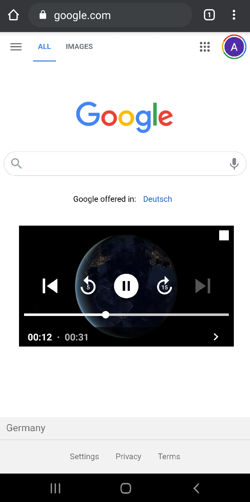

## Floating Video Player
This library uses Exo Player as Video Player with ability to use it on a Floating window.


---
### Installation
Step 1. 
Add the JitPack repository to your build file

Add it in your root build.gradle at the end of repositories:

	allprojects {
		repositories {
			...
			maven { url 'https://www.jitpack.io' }
		}
	}
Step 2. Add the dependency

	dependencies {
            implementation 'com.github.xeinebiu:android_floating_video:1.3.0'
	}

---
#### Register Service
````xml
<service
    android:name="com.xeinebiu.floating.video.VideoFloatingService"
    android:enabled="true"
    android:label="Floating Video" />
````
---
#### Overlay Permissions
Before you use the service, make sure your application is granted Overlay access.
```kotlin
    if (android.os.Build.VERSION.SDK_INT < android.os.Build.VERSION_CODES.M) {
        return // stop here, since devices with Android OS lower than M do not support screen overlay
    }

    if (!Settings.canDrawOverlays(this)) {
        val intent = Intent(
            Settings.ACTION_MANAGE_OVERLAY_PERMISSION,
            Uri.parse("package:$packageName")
        )
        startActivityForResult(intent, PERMISSION_DRAW_OVER_OTHER_APP)
        return
    }
```

---
### Starting the service
```kotlin
    val stream = Stream(
        Uri.parse("https://file-examples-com.github.io/uploads/2017/04/file_example_MP4_480_1_5MG.mp4"),
        HashMap()
    )
    VideoFloatingService.play(
        this,
        VideoItem("demo", listOf(stream))
   )
```

### Change logs
    1.3.0
        - Update dependencies
    1.1.0
        - Support Subtitles
    1.0.2
        - Fix: Service crashes when is already running and another stream is provided
    1.0.1
        - Support custom headers for each Stream
    1.0.0
        - Initial Release
